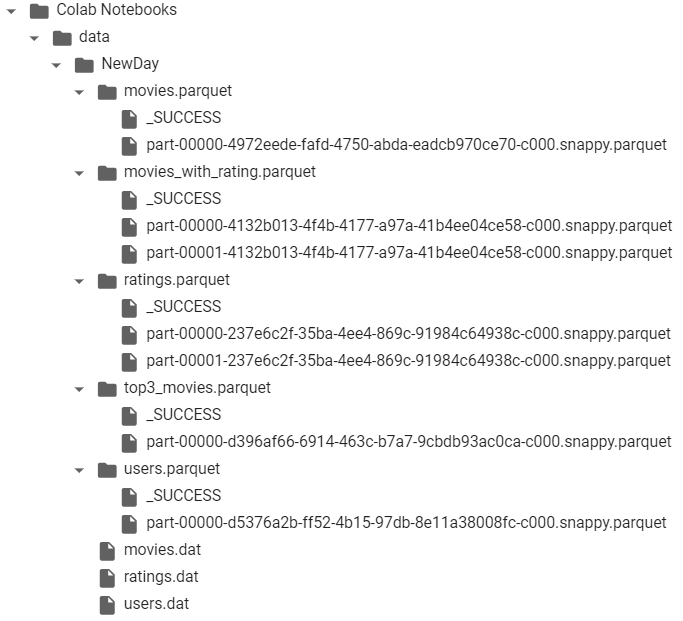

# NewDay assignment

## Spark submit command to submit the saprk job. Update the configuration based on your spark cluster
    
    spark-submit \
        --master <your_spark_master_url> \
        --conf spark.executor.memory=4g \
        --conf spark.driver.memory=2g \
        --conf spark.executor.cores=2 \
        --conf spark.driver.cores=1 \
        movies_ratings_analysis.py
    

- Replace <your_spark_master_url> with the URL of your Spark master. Make sure to configure Spark accordingly for your environment. 

- I don't have the spark environemnt in my local laptop that is why I ran the script on my google colab notebook. I loaded the input fiels and output files in my google drive.

- This is how my google drive directory looks like:

     <!-- {"left" : 0.26, "top" : 1.45, "height" : 6.17, "width" : 9.74} -->

## movies_rating_analysis.py
This is our main code which perform below tasks:

1.  Read in movies.dat and ratings.dat to spark dataframes.
2. Creates a new dataframe, which contains the movies data and 3 new columns max, min and 
average rating for that movie from the ratings data.
3. Create a new dataframe which contains each user’s (userId in the ratings data) top 3 movies 
based on their rating.
4. Write out the original and new dataframes in an efficient format of your choice.
